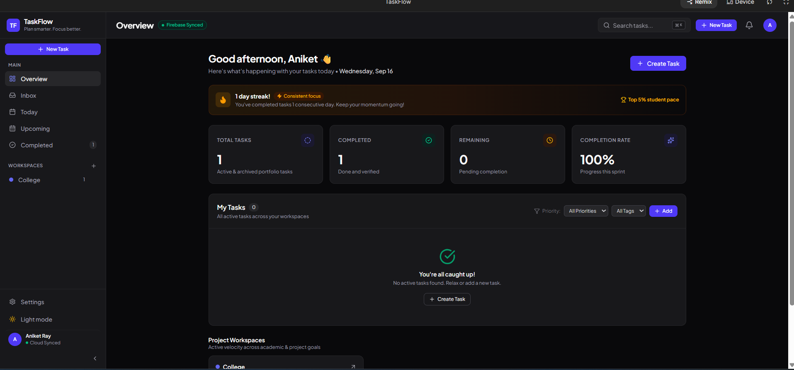
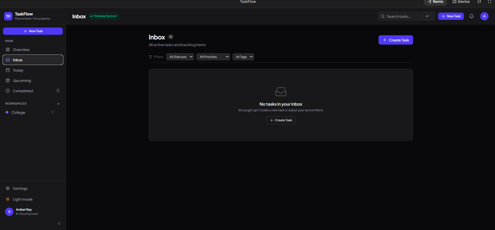
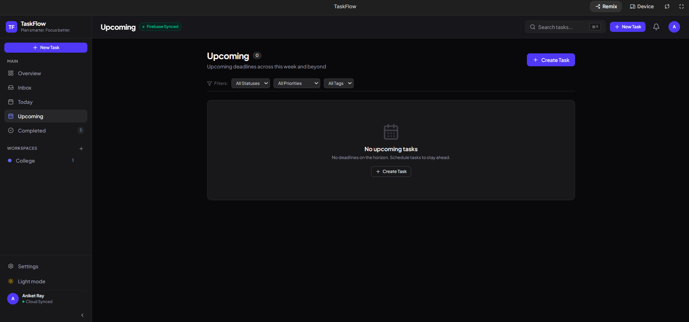
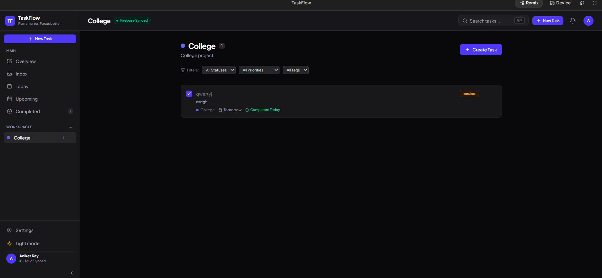
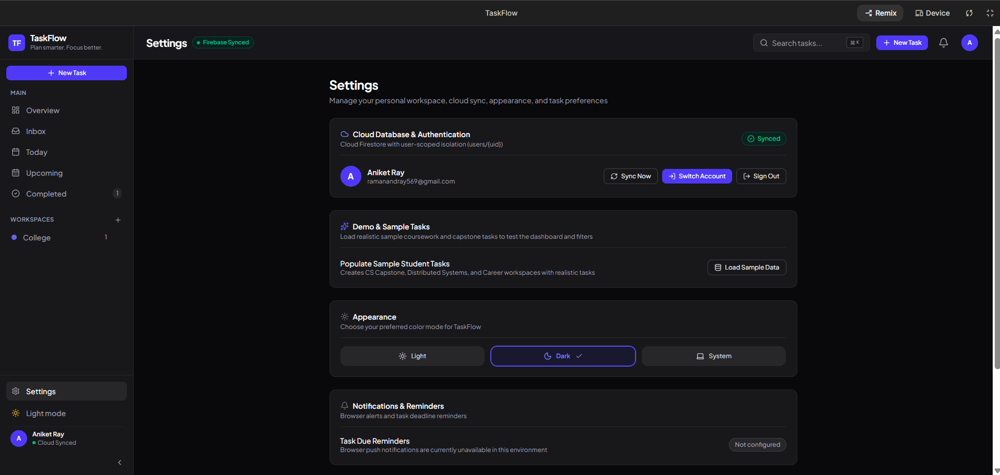

# TaskFlow

> **Plan smarter. Focus better. Get things done.**

TaskFlow is a modern productivity and task management application designed to help users organize tasks, manage projects, track progress, and stay focused.

---
## 🏛️ System Architecture

TaskFlow uses a modern decoupled architecture:

- **Frontend**: React + TypeScript + Vite
- **Authentication & Data**: Firebase Authentication + Cloud Firestore
- **Backend**: Python FastAPI backend preserved as a separate API service.

The current AI Studio frontend uses Firebase directly for its active task/project/tag persistence, while the FastAPI backend is a separate deployable API component.

```text
┌─────────────────────────────────────────────────────────────┐
│                    TaskFlow Client (SPA)                    │
│        React 19 • TypeScript • Vite • Tailwind CSS          │
│               Zustand Store (Optimistic Updates)            │
└──────────────────────────────┬──────────────────────────────┘
                               │
                               │ Direct Real-time & CRUD Persistence
                               ▼
┌─────────────────────────────────────────────────────────────┐
│             Firebase Auth & Cloud Firestore                 │
│             User-Scoped Subcollection Hierarchy             │
│            ├── users/{uid}/tasks/{taskId}                   │
│            ├── users/{uid}/projects/{projectId}             │
│            └── users/{uid}/tags/{tagId}                     │
└──────────────────────────────▲──────────────────────────────┘
                               │
                               │ Optional / Separate API Service
                               │ Google Cloud Firestore SDK
┌──────────────────────────────┴──────────────────────────────┐
│          TaskFlow Backend (Separate API Service)            │
│             FastAPI • Pydantic v2 • Python 3.11+            │
│       ├── Auth Dependency (get_current_user)               │
│       │   └── firebase_admin.auth.verify_id_token()         │
│       ├── Routers: /tasks, /projects, /tags, /health        │
│       └── Firestore Service Layer                           │
└─────────────────────────────────────────────────────────────┘
```

---

## 🔒 Security Architecture

Security was engineered as a core foundation rather than an afterthought:

1. **Zero Hardcoded Secrets & Configuration Separation**: The client browser uses standard, public Firebase Web SDK configuration (supplied via `VITE_FIREBASE_*` environment variables) to connect to Firebase Authentication and Firestore, while sensitive Firebase Admin credentials, service accounts, and private keys (`FIREBASE_PRIVATE_KEY`) remain strictly server-side environment variables. No private credentials or secrets exist in the git history or codebase.
2. **Authentication & API Security**: The active browser client uses Firebase Authentication and the Firebase Web SDK for user-scoped Firestore access. The separate FastAPI service accepts Firebase ID tokens and verifies them server-side when the API is used.

3. **Guaranteed Data Isolation**: No client query can read or write documents outside its authenticated path. Every database query strictly resolves to `users/{current_user.uid}/<collection>/<doc_id>`. User A cannot view, mutate, or delete records belonging to User B, even if they guess or supply User B's entity IDs.
4. **Input Sanitization & Schema Validation**: Strict Pydantic v2 models on the backend and Zod schemas on the frontend validate payloads at the boundaries, rejecting oversized fields, malformed formats, and unexpected properties.

---


## ✨ Features

### Task Management
- Create, edit, complete, and delete tasks
- Set priorities and due dates
- Add descriptions and subtasks
- Track completed and remaining work

### Workspace Management
- Create and manage project workspaces
- View workspace progress and completion percentage
- View workspace details and task statistics
- Edit or delete workspaces

### Productivity
- Overview dashboard
- Inbox, Today, Upcoming, and Completed views
- Search and multi-filter tasks
- Completion statistics and daily streaks
- Progress tracking for each workspace

### User Experience
- Firebase Authentication
- Cloud Firestore persistence
- Light, Dark, and System appearance modes
- Responsive mobile-friendly interface
- Loading, empty, and error states
- Export workspace data as JSON

## 🛠️ Tech Stack

| Category | Technology |
|---|---|
| Frontend | React 19, TypeScript, Vite |
| Styling | Tailwind CSS |
| State Management | Zustand |
| Authentication | Firebase Authentication |
| Database | Cloud Firestore |
| Backend API | Python, FastAPI |
| Validation | Zod |
| Testing | Vitest |
| Icons | Lucide React |


---

## 🚀 Local Development Setup

### Prerequisites
- Node.js 20+ and npm
- Python 3.11+ (for running the local FastAPI service)
- A Firebase project (or use the preconfigured environment variables)

### 1. Frontend Setup
```bash
# Clone the repository
git clone https://github.com/Aniket2a/TaskFlow.git
cd taskflow

# Install dependencies
npm install

# Configure environment variables
cp .env.example .env.local

# Run the development server
npm run dev
```
The application will launch at `http://localhost:3000`.

### 2. Backend Setup
```bash
cd backend

# Create and activate a virtual environment
python3 -m venv .venv
source .venv/bin/activate  # On Windows: .venv\Scripts\activate

# Install dependencies
pip install -r requirements.txt

# Configure environment variables
cp .env.example .env

# Run FastAPI backend with live reload
uvicorn app.main:app --reload --port 8000
```
Interactive API documentation will be available at `http://localhost:8000/docs`.

---

## 📡 REST API Reference

All `/api/v1/*` routes (except `/api/v1/health`) require a valid Firebase bearer token:
`Authorization: Bearer <FIREBASE_ID_TOKEN>`

| Method | Endpoint | Description | Auth Required |
| :--- | :--- | :--- | :---: |
| `GET` | `/api/v1/health` | Service health and environment status | No |
| `GET` | `/api/v1/tasks` | List all tasks for authenticated user | Yes |
| `POST` | `/api/v1/tasks` | Create a new task | Yes |
| `GET` | `/api/v1/tasks/{id}` | Get single task details | Yes |
| `PATCH` | `/api/v1/tasks/{id}` | Update task properties (status, priority, etc.) | Yes |
| `DELETE` | `/api/v1/tasks/{id}` | Delete task | Yes |
| `GET` | `/api/v1/projects` | List all user projects | Yes |
| `POST` | `/api/v1/projects` | Create a new project workspace | Yes |
| `PATCH` | `/api/v1/projects/{id}` | Update project metadata | Yes |
| `DELETE` | `/api/v1/projects/{id}` | Delete project (automatically unlinks tasks) | Yes |
| `GET` | `/api/v1/tags` | List all user tags | Yes |
| `POST` | `/api/v1/tags` | Create a new tag | Yes |
| `DELETE` | `/api/v1/tags/{id}` | Delete tag | Yes |

---

## 🧪 Running Automated Tests

TaskFlow includes thorough test suites across both tiers of the stack.

### Frontend Tests (Vitest)
```bash
# Run all frontend tests (unit, store, validation schemas, UI components)
npm test
```
*Current frontend test suite: 50 passing tests across 5 test suites.*

### Backend Tests (Pytest)
```bash
cd backend
# Run all backend tests with coverage report
pytest tests/ -v
```
*Tests verify token authentication rejection, task CRUD, 422 input validation, project deletion cascading, and user isolation.*

---

## 💡 Engineering Decisions & Trade-Offs

### 1. Firestore Subcollections vs. Flat Root Collections
* **Decision**: Organized all user documents under the hierarchical path `users/{uid}/tasks/{taskId}` rather than a flat root collection `tasks/{taskId}` with a `userId` field.
* **Trade-off**: Querying across all users requires collection group queries, but hierarchical subcollections provide absolute structural isolation, simplified security rules, easier per-user document cleanup upon account deletion, and prevent accidental data leakage from misconfigured queries.

### 2. Optimistic UI Updates in Client State
* **Decision**: The Zustand store immediately updates local state upon user interaction (e.g., clicking a task checkbox or adding a task) before awaiting the network response.
* **Trade-off**: Requires writing rollback logic if the network request fails, but provides instantaneous, lag-free perceived performance essential for high-frequency productivity applications.

### 3. FastAPI with Pydantic v2 vs. Traditional Django/Flask
* **Decision**: Selected FastAPI over Django or Flask for the microservice backend.
* **Trade-off**: Django includes built-in ORM and admin panels, but for a modern decoupled architecture where Firebase handles database and authentication, FastAPI provides significantly faster serialization performance, native async/await for I/O-bound database calls, and automatic OpenAPI schema generation.

---

## 🗺️ Future Improvements

- [ ] **Offline IndexedDB Caching**: Persist local state across browser restarts when offline using Dexie.js or TanStack Query.
- [ ] **Collaborative Project Sharing**: Allow multi-user assignments and shared team workspaces with role-based permissions (Viewer, Editor, Admin).
- [ ] **Calendar Two-Way Sync**: Export tasks as `.ics` feeds or sync deadlines directly with Google Calendar.
- [ ] **Web Push Notifications**: Service worker notifications for upcoming deadlines and streak reminders.

---

## 📄 License & Attribution

Distributed under the MIT License. See `LICENSE` for more information.

Built with dedication as a modern software engineering portfolio project.


## Screenshots

### Overview


### Inbox


### Upcoming


### Workspace


### Settings
